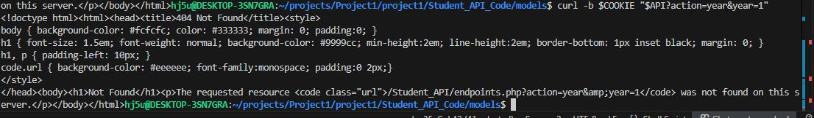
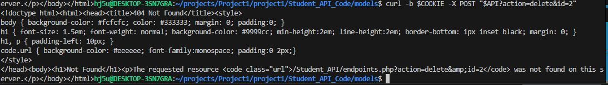

<!-- _class: lead -->
<!-- _class: frontpage -->
<!-- _paginate: skip -->

# REST API Examples
---
# Curl Commands
  For GET:
  Get all students:

  

  Get by Name:

  

  Get by ID:

  

  Get by Major:

  

  Get by Course:

  

  Get by Year:

   
---
  For POST:

  Create student:

  

  Login:

  
---
  For PUT:

  Update Student:

  
---
  For DELETE:

  Delete Student:

  

  Delete all students:

  
---
# HTML/Javascript

  For GET:
  
  Get all students:

  

  

  Get by Name:

  

  Get by ID:

  

  Get by Course:

  

  Get by Major:

  

  Get by Year:

  
---
  For POST:

  Login:

  

  

  

  Create Student:

  
---
  For PUT:

  Update Student:

  
---
  For DELETE:

  Delete student:

  

  Delete all student:

  
---
